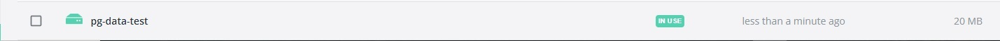
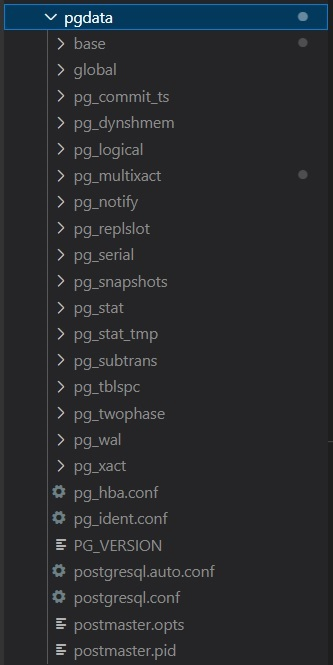

# Instrukcja
W folderze z plikiem docker-compose.yml i docker-compose-test.yml:
```sh
.\run.ps1
```
Po zatrzymaniu docker-compose można usunąć niepotrzebne kontenery, wolumin i folder pgdata poleceniem:
```sh
.\clean.ps1  
``` 

# Przykład polecenia z run.ps1:
Odpalenie środowiska testowego z określonym plikiem .yml oraz własną nazwą projektu
```sh
docker-compose -f .\docker-compose-test.yml -p todo-app-test up -d
```

# Screenshot
#### Uruchomiony projekt, możemy zobaczyć ustawione porty 8089 i 8080

#### Dane dla kontenera bazy danych testowej są przechowywane w volume

#### Dane kontenera bazy danych produkcyjnego używają lokalnych plików
